# AtividadesMusicas

# Link Do Drive
Videos:
https://drive.google.com/file/d/1qgdXi45Rg7dmvBopes7Hqdy2rCcqwVWP/view?usp=drive_link
https://drive.google.com/file/d/1JOTvqYpte1tET8gSJwC1LXkWRXZaJY4V/view?usp=drive_link

https://drive.google.com/drive/folders/1S_ftPZ37fnE9mTqpsUsscoRpROgtL3Ih?usp=drive_link

# Descrição

Este é um jogo feito no Unity 3d baseado nas músicas "A Dona Aranha" e "Atirei o pau no gato", onde o objetivo é passar de obstáculos e chegar ao fim

# Cenas

Para a criação desta cena, foram utilizados GameObjects , assests gratuitos da Unity store, e objetos modelados no blender.

# GameObject
Aranha. 
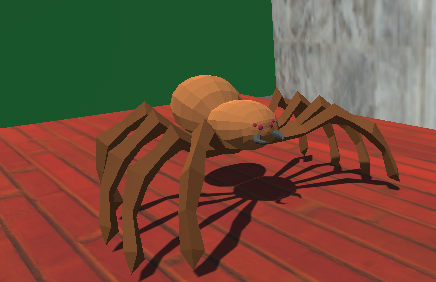
 
Casa (deitada para dar a impressão de estar subindo). 
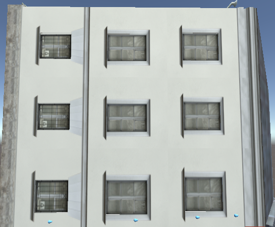
 
Gota (feita no blender). 
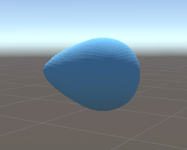
 
Chão. 
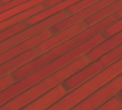
 
Cube (utilizado para fazer a troca de cena).  
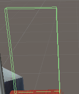
 

# Cena 2

Gato.  
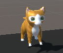
 
Lojas.  
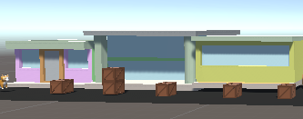
 
Caixas.  
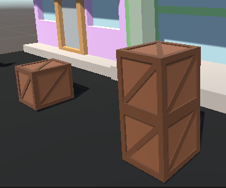
 
Chão.  

 
Cube(utilizado para fazer a troca de cena).  
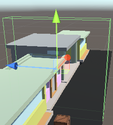
 

# Cena 3

Texto.  
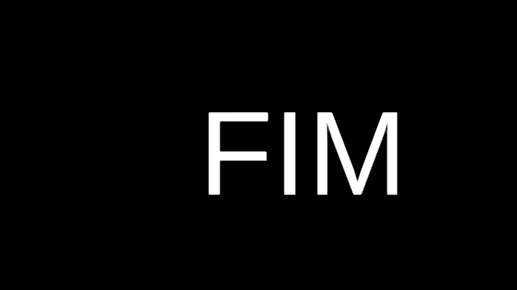
 

# Scripts

Bater.  
 
Esse script é usado para recarregar a cena atual quando o jogador colide com um objeto que possui este script e é identificado como o jogador através da tag "Player".
 
PassarFase.  
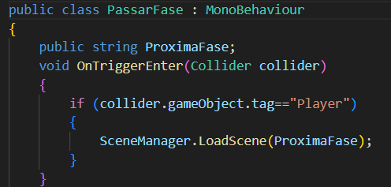 
Este script é usado para permitir que o jogador passe para a próxima fase do jogo quando colidir com um objeto que possui este script e é identificado como o jogador pela tag "Player".
 
Movimento.  
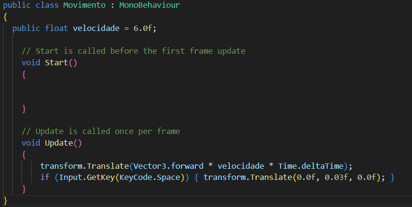 
Este script permite que um objeto se mova para a frente a uma velocidade definida pela variável "velocidade" e também permite que o objeto pule ligeiramente no eixo vertical quando a tecla de espaço é pressionada.
 
